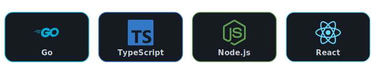

<!-- ====== HEADER BANNER ====== -->
<div align="center">


<a href="https://linkedin.com/in/thato-maake">
  
</a>
<a href="mailto:tmthatoo4@gmail.com">
  
</a>
<a href="https://thatooinemaake.com">
  
</a>


</div>

<!-- ====== TYPING INTRO ====== -->
<div align="center">

[](https://git.io/typing-svg)

</div>

---

## 🚀 About Me

```go
package main

type Engineer struct {
    Name        string
    Role        string
    Location    string
    Experience  int
    Focus       []string
}

func main() {
    me := Engineer{
        Name:       "Thato Lekukela Maake",
        Role:       "Senior Software Engineer @ Mesh.Trade",
        Location:   "South Africa 🇿🇦",
        Experience: 5,
        Focus: []string{
            "Distributed Systems", "Microservices", "gRPC",
            "Google Cloud Platform", "Event Streaming",
            "Observability",
        },
    }
    me.Ship() // 🚢 end-to-end, from concept to production
}
```

- 🔭 I **lead backend development** of distributed microservices in **Go**
- 🧩 I design **gRPC APIs** with Protocol Buffers, real-time **event streaming**, and resilient **distributed transaction systems**
- ☁️ I own **GCP deployments** — Cloud Run, App Engine, Pub/Sub — with **OpenTelemetry** tracing & structured logging
- 🎓 **BSc Computer Science & Mathematics** + **Applied Mathematics Honours (Distinction)** — North-West University
- 🏆 **2nd Place** — Standard Bank Coding Challenge
- 🌱 Always sharpening: system design, performance, and clean architecture

---

## 🛠️ Tech Stack

<div align="center">



</div>

#### Languages


#### Backend & Distributed Systems


#### Cloud & DevOps


#### Data & Frontend


---

## 🧱 Featured Projects

| Project | What it shows | Stack |
|---|---|---|
| **[RestaurantOS](https://github.com/Thatooine/RestaurantOS)** | Domain-driven service design | Go |
| **[loyalty-points-app](https://github.com/Thatooine/loyalty-points-app)** | Transactional business-logic service | Go |
| **[go-test-html-report](https://github.com/Thatooine/go-test-html-report)** | Developer tooling for Go test reporting ⭐ | Go |

---

## 💼 Experience Snapshot

```text
Mesh.Trade   │ Senior Software Engineer ── Product Team   │ Aug 2023 – Present
Mesh.Trade   │ Software Engineer ──────── Product Team     │ Mar 2022 – Aug 2023
Andile Sol.  │ Software Engineer ──────── Product Team     │ Jan 2019 – Mar 2022
```

---

## 📫 Let's Connect

<div align="center">

I'm open to opportunities in **backend / distributed systems / platform engineering**.

<a href="https://linkedin.com/in/thato-maake"></a>
<a href="mailto:tmthatoo4@gmail.com"></a>
<a href="https://thatooinemaake.com"></a>


</div>

<!-- profile readme -->
